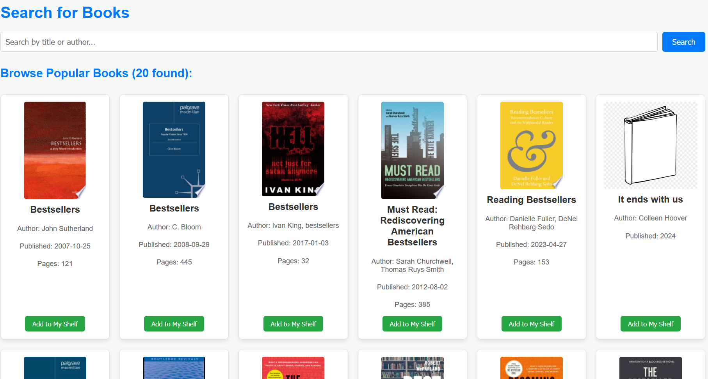
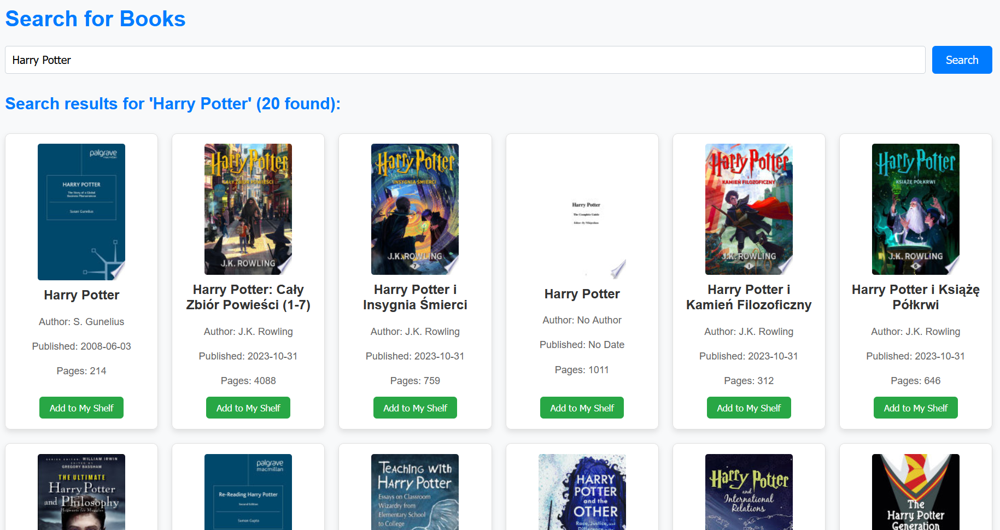

# Digital Library
App for book browsing and categorization 

---

## Project Goal


The primary goal of this project is to create a comprehensive tool for book enthusiasts, enabling easy cataloging, organizing, and tracking of reading progress. The application will allow users to add, view, edit, and delete books, assign them to categories, and monitor their reading status.


---

## So far implemented:
- book and category model in database
- book browsing (via API)
- adding book to (to-read, reading, read)  collection
- adding book manualy (for testing)
- adding to favourite and filtering by favourite
---
## TO DO:
 - adding book category (for the books from API now they are all uncategorized)
 - when clicking on the book maybe more info?
 - maybe more filters for browsing
 - diagrams and stats for your books

---
## Key Features


* **CRUD Operations:** Add, view, edit, and delete book entries.
* **Categorization:** Organize books into various categories (e.g., fantasy, science fiction, non-fiction).
* **Reading Progress Tracking:** Monitor reading status (to-read, in-progress, completed) and current page progress.
* **Search & Filter:** Efficiently search and filter books by various criteria.
* **Data Import/Export:** Import and export book data (e.g., to/from CSV/JSON formats).
* **External API Integration (Planned):** Integrate with external APIs (e.g., Open Library, Google Books) for quick metadata retrieval.
* **Reading Statistics (Planned):** Visualize reading habits and statistics (e.g., number of books read, genre distribution).

---

## System Requirements

* Python 3.8+
* pip package manager

---

## Getting Started

Local setup:

1.  **Clone the Repository:**
    ```bash
    git clone ...
    cd this-repo
    ```

2.  **Create and Activate a Virtual Environment:**
    Use a virtual environment to manage project dependencies.

    * **Windows:**
        ```bash
        python -m venv venv
        .\venv\Scripts\activate
        ```
    * **macOS / Linux:**
        ```bash
        python3 -m venv venv
        source venv/bin/activate
        ```

3.  **Install Dependencies:**
    All required packages are listed in `requirements.txt`.

    ```bash
    pip install -r requirements.txt
    ```

4.  **Set Environment Variables:**
    Create a file named `.flaskenv` in the root directory of your project and add the following content:

    ```
    FLASK_APP=app.py
    FLASK_ENV=development
    SECRET_KEY='your_super_secret_key_here' # Change this to a strong, unique key
    ```
    *Note: `python-dotenv` will automatically load these variables when `flask run` is executed.*

---  

5.  **For the first time and after any changes in `models.py` - upgrade database:**

    ```bash
    flask db upgrade
    ```
---   

6.  **Add no-cover img:**
    It should be in folder satic named `no_cover.png` it will be shown when a book has no cover picture available from API
    

---   

7.  **Run the Flask Application:**
    ```bash
    flask run
    ```
    The application should now be accessible in your web browser at: `http://127.0.0.1:5000/`

---

## Screenshots

### Home page - your collection


### Browse with API

Empty search - browse 20 popular books



### Search results

Example search "Harry Potter"




---

## Example Test Data

*(Link to an example CSV/JSON file with test book data for import will be provided here.)*