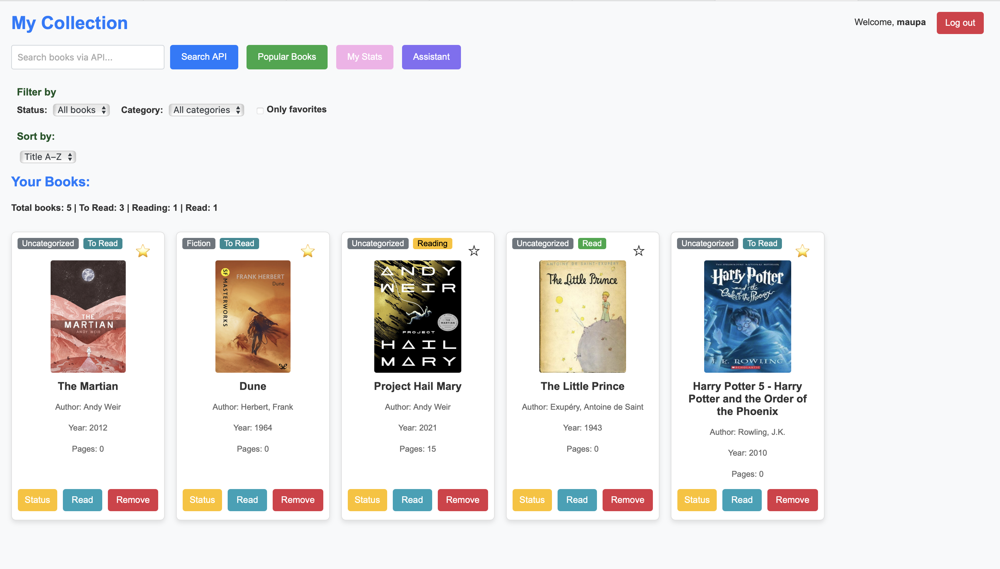

# Digital Library
App for book browsing, categorization and digital reading 

---

## Project Goal


The primary goal of this project is to create a comprehensive tool for book enthusiasts, enabling easy cataloging, organizing, and tracking of reading progress. The application will allow users to add (from API), view, edit, and delete books, assign them to categories, and monitor their reading status. Users can also see their detailed statistics and add reviews.


---
## Key Features


* **CRUD Operations:** Add, view, edit, and delete book entries.
* **Categorization:** Organize books into various categories (e.g., fantasy, science fiction, non-fiction).
* **Reading Progress Tracking:** Monitor reading status (to-read, in-progress, completed) and current page progress.
* **Add to favourite:** Add books to favourites (you can also filter by favourites)
* **Search & Filter:** Efficiently search and filter books by various criteria (status, category, year, title).
* **Reading Statistics:** Visualize reading habits and statistics (number of books read, genre distribution, pages).
* **Book details and reviews:** Add review to books from your collection and see other reviews
* **Data Import/Export:** Import static categories data from JSON
* **External API Integration:** Integrated with Anna's Archive API for pdf browsing and downloading
* **AI assistant:** Ask assistant for book reccomendation
---

## System Requirements

* Python 3.8+
* pip package manager

---

## Getting Started

Local setup:

1.  **Clone the Repository:**
    ```bash
    git clone ...
    cd this-repo
    ```

2.  **Create and Activate a Virtual Environment:**
    Use a virtual environment to manage project dependencies.

    * **Windows:**
        ```bash
        python -m venv venv
        .\venv\Scripts\activate
        ```
    * **macOS / Linux:**
        ```bash
        python3 -m venv venv
        source venv/bin/activate
        ```

3.  **Install Dependencies:**
    All required packages are listed in `requirements.txt`.

    ```bash
    pip install -r requirements.txt
    ```

4.  **Set Environment Variables:**
    Create a file named `.flaskenv` in the root directory of your project and add the following content:

    ```
    FLASK_APP=app.py
    FLASK_ENV=development
    SECRET_KEY='your_super_secret_key_here' # Change this to a strong, unique key
    ```
    *Note: `python-dotenv` will automatically load these variables when `flask run` is executed.*

    For API integration you need your personal access key. You can get it there: https://rapidapi.com/tribestick-tribestick-default/api/annas-archive-api (free plan is enough) and then put it in `.env` file in the root of this project:

    ```
    RAPIDAPI_KEY = XXXXXXX
    ```
    
---  

5.  **Upgrade database:** when running the first time and after any changes in `models.py`

    ```bash
    flask db upgrade
    ```
---   

6.  **Add no-cover img:**
    It should be in folder satic named `no_cover.png` it will be shown when a book has no cover picture available from API
    

---   

7.  **Run the Flask Application:**
    ```bash
    flask run
    ```
    The application should now be accessible in your web browser at: `http://127.0.0.1:5000/`

---

## Visualization

### Home page - your collection



### Search with API

Example search "The Lord of the Rings"


### Browse (for logged and unlogged) - all books in the system


### Statistics


### Book details and opinions


### AI assistant


